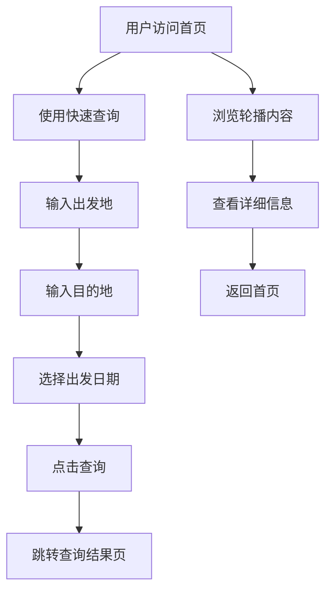

# 铁路12306系统首页制作PRD

**文档版本：** v3.0  
**创建日期：** 2024年12月  
**最后更新：** 2024年12月  
**文档状态：** 规范化完成 - Scenario格式  
**负责人：** 产品团队  
**格式规范：** BDD (Behavior Driven Development) - Given/When/Then/And

### 文档格式说明

本PRD文档采用BDD（行为驱动开发）的Scenario格式进行规范化，使用以下结构：

- **Scenario**: 描述具体的业务场景
- **Given**: 前置条件，描述场景的初始状态
- **When**: 触发条件，描述用户的操作行为
- **Then**: 预期结果，描述系统应该产生的响应
- **And**: 补充条件，用于扩展Given、When或Then的内容

这种格式有助于开发团队更清晰地理解需求，便于测试用例编写和验收标准制定。

## 1. 产品概述

铁路12306系统首页是整个火车票预订平台的门户入口，承担品牌展示、用户引导和核心功能快速访问的重要职责。首页需要体现中国铁路12306的官方权威性，同时提供便捷的车票查询入口和完整的功能导航体系。

## 2. 核心功能场景

### 2.1 首页访问和展示

#### 2.1.1 用户首次访问首页
        Scenario: 用户首次访问12306首页
            Given 用户打开浏览器
            When 用户输入12306官网地址并访问
            Then 系统显示完整的首页内容
            And 顶部导航栏显示品牌Logo和主要功能菜单
            And 轮播展示区自动播放品牌宣传内容

#### 2.1.2 页面加载性能验证
        Scenario: 验证首页加载性能
            Given 用户网络环境正常
            When 用户访问12306首页
            Then 页面在2秒内完全加载完成
            And 轮播图片正常显示无破损
            And 所有功能图标清晰可见
            And 页面布局稳定无跳动

### 2.2 车票查询功能

#### 2.2.1 正常车票查询流程
        Scenario: 用户进行车票查询
            Given 用户在**首页**
            When 用户在出发地输入框输入"北京"
            And 用户在目的地输入框输入"上海"
            And 用户选择出发日期为明天
            And 用户点击"查询"按钮
            Then 系统验证输入信息格式正确
            And 查询按钮显示loading状态
            And 系统跳转到车次查询结果页面

#### 2.2.2 城市输入支持拼音搜索
        Scenario: 用户使用拼音搜索城市
            Given 用户在**首页**的查询表单
            When 用户在出发地输入框输入"bj"
            Then 系统显示包含"北京"的城市下拉列表
            And 用户可以点击选择"北京"
            And 输入框显示选中的城市名称

#### 2.2.3 查询表单验证
        Scenario: 查询信息不完整时的验证
            Given 用户在**首页**的查询表单
            When 用户只输入出发地"北京"但未输入目的地
            And 用户点击"查询"按钮
            Then 系统不执行查询操作
            And 目的地输入框显示红色边框
            And 页面提示"请选择目的地"

#### 2.2.4 日期选择限制
        Scenario: 验证日期选择范围限制
            Given 用户在**首页**的查询表单
            When 用户点击出发日期选择器
            Then 系统显示日期选择面板
            And 当前日期之前的日期显示为不可选状态
            And 当前日期起14天后的日期显示为不可选状态
            And 用户只能选择有效范围内的日期


### 2.4 轮播展示交互

#### 2.4.1 轮播自动播放
        Scenario: 验证轮播自动播放功能
            Given 用户在**首页**
            When 页面加载完成
            Then 轮播区域开始自动播放
            And 每5秒自动切换到下一张图片
            And 轮播指示器正确显示当前页面位置

#### 2.4.2 轮播手动控制
        Scenario: 用户手动控制轮播
            Given 用户在**首页**且轮播正在自动播放
            When 用户点击第3个轮播指示器
            Then 轮播立即切换到第3张图片
            And 自动播放暂停
            And 轮播指示器更新为第3个高亮状态

#### 2.4.3 轮播悬停暂停
        Scenario: 鼠标悬停暂停轮播
            Given 用户在**首页**且轮播正在自动播放
            When 用户鼠标悬停在轮播区域
            Then 轮播自动播放暂停
            And 鼠标移开后轮播恢复自动播放

### 2.2 页面详情

| 模块名称 | 功能组件 | 功能描述 |
| ---- | ----- | ----------- |
| 顶部导航栏 | 品牌Logo | 显示"中国铁路12306"官方标识，点击返回首页 |
| 顶部导航栏 | 主导航菜单 | 包含首页、车票、订单、客运服务、铁路货运、信息查询等主要功能入口 |
| 顶部导航栏 | 搜索框 | 提供全站搜索功能，支持车站、车次、政策等内容搜索 |
| 顶部导航栏 | 用户登录区 | 显示登录、注册、English等用户相关操作入口 |
| 轮播展示区 | 主视觉轮播 | 自动轮播展示高铁形象、服务宣传、重要通知等内容；包含6张图片，Web路径分别为 `/images/home-carousel/首页_轮播底图1.png` ~ `/images/home-carousel/首页_轮播底图6.png`（资源放置于 `frontend/public/images/home-carousel/`） |
| 轮播展示区 | 轮播指示器 | 显示当前轮播位置，支持手动切换轮播内容 |
| 快速查询表单 | 出发地选择 | 支持简拼/全拼/汉字输入与联想下拉；右侧定位图标；与到达地可交换 |
| 快速查询表单 | 目的地选择 | 支持简拼/全拼/汉字输入与下拉联想；右侧定位图标；与出发地可交换 |
| 快速查询表单 | 出发日期 | 右侧日历图标与输入框均可触发日期面板；显示YYYY-MM-DD；限制当前日起14天内可选；面板并排显示相邻两个月；数字等宽对齐；当天显示“今天” |
| 快速查询表单 | 行程类型切换 | Tabs：单程/往返/中转换乘/退改签；默认单程；往返显示返程日期；每个Tab配有选中/未选中图标（如“单程_logo_选中/未选中”等） |
| 快速查询表单 | 返程日期（往返） | 仅往返模式显示；右侧日历图标与输入框可触发同款日期面板；格式YYYY-MM-DD；同样限制当前日起14天内可选 |
| 快速查询表单 | 乘客类型 | “学生”复选框（单程/往返/中转换乘显示；退改签隐藏） |
| 快速查询表单 | 高铁/动车筛选 | 仅单程/往返显示的复选框，用于过滤车次 |
| 快速查询表单 | 查询按钮 | 橙色主按钮（文案“查 询”）；点击执行查询并跳转结果页 |

## 3. 核心流程

### 3.1 用户访问流程
1. 用户访问12306首页，系统加载完整页面内容
2. 用户浏览轮播展示区的宣传内容和重要信息
3. 用户通过快速查询表单输入出行需求
4. 用户点击查询按钮，系统验证输入信息
5. 系统跳转到车次查询结果页面




## 4. 用户界面设计

### 4.1 设计风格

**色彩方案：**
* 主色调：深蓝色渐变（#1E3A8A 到 #3B82F6）体现铁路官方权威性
* 辅助色：红色（#E60012）用于重要标识和logo
* 背景色：白色（#FFFFFF）和浅灰色（#F8FAFC）保证内容清晰
* 强调色：橙色（#FF6600）用于查询按钮和重要操作

**字体规范：**
* 主标题：微软雅黑 Bold 18px，颜色 #1F2937
* 副标题：微软雅黑 Regular 16px，颜色 #4B5563
* 正文内容：微软雅黑 Regular 14px，颜色 #374151
* 辅助文字：微软雅黑 Regular 12px，颜色 #6B7280
* 导航文字：微软雅黑 Regular 14px，颜色 #FFFFFF

**布局原则：**
* 采用1200px固定宽度居中布局
* 模块间距离保持24px-32px
* 重要内容突出显示，次要内容适当弱化
* 保持视觉层次清晰，信息组织有序
* 卡片设计采用圆角（8px）和轻微阴影效果

### 4.2 页面布局设计

| 区域名称 | 位置 | 尺寸规格 | 设计要点 |
| ---- | ---- | ---- | ---- |
| 顶部导航栏 | 页面顶部 | 宽度100%，高度60px | 蓝色渐变背景，白色文字，12306 Logo居左，主导航居中，搜索框和用户操作居右 |
| 轮播展示区 | 导航栏下方 | 宽度100%，高度480px | 深蓝色渐变背景；轮播指示器居中下方；查询卡片叠加在轮播图内 |
| 快速查询区 | 轮播图左侧叠加 | 宽度约420px | 白色卡片；位置：距左约120px、距上约40px；顶部Tabs（单程/往返/中转换乘/退改签）带选中/未选中图标。单程：出发/到达/出发日期+“学生”“高铁·动车”复选。往返：在单程基础上增加返程日期（与出发日期相同的弹出式日历）。中转换乘：出发/到达/乘车日期，仅“学生”复选；隐藏“高铁·动车”。退改签：查询类型（订票日期/乘车日期）单选、开始/结束日期与“关键词（订单号/车次/乘客姓名）”输入；站点与复选框隐藏；开始/结束日期使用同款弹出式日历；统一橙色“查 询”按钮 |

### 4.3 交互设计场景

#### 4.3.1 鼠标悬停交互效果

        Scenario: 导航菜单悬停效果
            Given 用户在**首页**
            When 用户鼠标悬停在顶部导航菜单项上
            Then 菜单项背景色变为深蓝色（#1E40AF）
            And 文字保持白色
            And 菜单项下方显示下划线
            And 鼠标移开后效果消失
    
    
        Scenario: 查询按钮悬停效果
            Given 用户在**首页**的查询表单
            When 用户鼠标悬停在"查询"按钮上
            Then 按钮背景色从橙色变为深橙色（#EA580C）
            And 按钮添加轻微阴影效果
            And 鼠标移开后按钮恢复原始样式
    

#### 4.3.2 点击反馈交互

        Scenario: 查询按钮点击反馈
            Given 用户在**首页**的查询表单
            When 用户点击"查询"按钮
            Then 按钮显示0.15秒按下动画效果
            And 按钮内显示loading状态（旋转图标）
            And 按钮文字变为"查询中..."
            And 按钮在查询期间不可再次点击
    
    
        Scenario: 表单输入框聚焦反馈
            Given 用户在**首页**的查询表单
            When 用户点击出发地输入框
            Then 输入框边框变为蓝色（#3B82F6）
            And 输入框添加蓝色阴影效果
            And 输入框获得焦点状态
            And 失去焦点时边框和阴影恢复默认状态

#### 4.3.3 响应式布局适配

        Scenario: 桌面端布局显示
            Given 用户使用桌面设备（屏幕宽度>1200px）
            When 用户访问**首页**
            Then 页面显示完整布局
            And 查询表单固定在轮播图左侧
    
        Scenario: 平板端布局适配
            Given 用户使用平板设备（屏幕宽度768px-1200px）
            When 用户访问**首页**
            Then 导航栏收缩显示
            And 查询表单居中显示在轮播图下方
            And 所有功能正常可用
    
        Scenario: 移动端布局适配
            Given 用户使用手机设备（屏幕宽度<768px）
            When 用户访问**首页**
            Then 页面采用单列布局
            And 查询表单宽度适配屏幕
            And 所有交互功能保持可用

### 4.4 详细视觉设计规范

**轮播区域设计：**
* 背景：深蓝色渐变（从#1E3A8A到#3B82F6），营造科技感和专业感
* 右侧装饰：立体票务图标设计，包含火车票、身份证等元素，体现业务特色
* 轮播指示器：白色圆点，当前页面高亮，位于底部居中
* 查询表单：白色卡片设计，圆角8px，轻微阴影效果

**查询表单设计：**
* 表单背景：纯白色（#FFFFFF），圆角8px
* 输入框样式：边框1px #E5E7EB，圆角4px，高度约32px；占位“简拼/全拼/汉字”；右侧定位/日历图标置于输入框内（后缀位置）
* 站点选择：点击右侧定位图标弹出站点选择器；站点按字母分组，采用分页（每页每个字母展示两行，每行六个城市）；无城市的字母不显示；不使用进度条滚动；选择后回填输入
* 站点交换：按钮位于两个站点输入的右侧列、垂直居中显示；不与输入框重叠；点击互换出发/到达
* 日期输入：右侧日历图标与输入框均可触发弹出式日历；并排显示相邻两个月；数字等宽对齐；当天显示“今天”；选择范围限制为当前日起14天内
* 模式差异：
  - 单程：显示出发/到达/出发日期；底部显示“学生”“高铁·动车”复选框
  - 往返：在单程基础上增加“返程日期”输入；复选框同单程
  - 中转换乘：显示出发/到达/乘车日期；仅“学生”复选框；隐藏“高铁·动车”
  - 退改签：显示查询类型单选（订票日期/乘车日期）、开始日期、结束日期与“关键词（订单号/车次/乘客姓名）”输入；隐藏站点/复选框
* 查询按钮：橙色背景（#FF6600），白色文字“查 询”，圆角4px，高度约40px

**功能导航图标设计：**
* 图标尺寸：48px × 48px
* 图标风格：线性图标，2px线宽，圆角端点
* 文字标签：12px，颜色#4B5563，居中对齐
* 悬停状态：图标背景添加浅色圆形高亮（#F3F4F6）


## 5. 技术实现要求

### 5.1 前端技术要求

**基础技术栈：**
* HTML5语义化标签，确保页面结构清晰
* CSS3实现样式效果，支持动画和过渡
* JavaScript实现交互功能，ES6+语法
* 响应式设计，支持多设备访问

**性能优化：**
* 图片懒加载，减少首屏加载时间
* CSS和JS文件压缩合并
* 轮播图片预加载，确保切换流畅
* 缓存策略优化，提升二次访问速度

**兼容性要求：**
* 支持Chrome 70+、Firefox 65+、Safari 12+、Edge 79+
* IE11基础兼容（功能可用，样式简化）
* 移动端Safari和Chrome兼容

### 5.2 数据接口要求

**城市数据来源：**
```
前端本地资源 /station_name.js（位于 frontend/public），解析其中变量 station_names 以获取城市列表；不调用官方接口
```

**车票查询接口：**
```
POST /api/tickets/search
请求参数：出发地、目的地、出发日期、返程日期、乘客类型
响应：符合条件的车次列表
```

**公告信息接口：**
```
GET /api/announcements
响应：最新公告列表，包含标题、发布时间、重要程度
```

### 5.3 SEO优化要求

**页面标题：**
* 首页标题：中国铁路12306 - 火车票网上订票官网
* Meta描述：中国铁路客户服务中心官方网站，提供火车票预订、查询、改签、退票等服务

**关键词优化：**
* 主要关键词：火车票、高铁票、12306、网上订票
* 长尾关键词：火车票查询、高铁时刻表、余票查询

**结构化数据：**
* 添加JSON-LD结构化数据标记
* 标记组织信息、服务信息、联系方式

### 5.4 用户体验和可访问性要求

**加载体验：**
* 首屏内容在2秒内显示完成
* 轮播图片采用渐进式加载，避免布局跳动
* 关键功能（查询表单）优先加载
* 加载过程显示骨架屏或加载动画

**表单体验：**
* 城市输入支持拼音搜索和模糊匹配
* 日期选择器默认显示今天和明天
* 表单验证实时反馈，错误信息明确
* 支持键盘Tab键导航

**可访问性：**
* 所有图片添加alt属性描述
* 表单元素关联正确的label
* 支持键盘导航，焦点状态清晰可见
* 色彩对比度符合WCAG 2.1 AA标准
* 支持屏幕阅读器访问

**性能优化：**
* 图片懒加载，减少初始加载时间
* CSS和JavaScript文件压缩和合并
* 启用浏览器缓存策略
* 图片格式优化（WebP优先，PNG/JPG降级）

## 6. 验收标准场景

### 6.1 功能验收场景

#### 6.1.1 页面加载验收

        Scenario: 验证首页加载性能
            Given 用户网络环境正常
            When 用户访问12306首页
            Then 页面在2秒内完全加载完成
            And 轮播图自动播放，每5秒切换一次
            And 轮播切换流畅无卡顿
            And 所有图片正常显示，无破损或404错误
            And 轮播指示器正确显示当前页面状态

#### 6.1.2 查询功能验收

        Scenario: 验证城市选择功能
            Given 用户在**首页**的查询表单
            When 用户点击出发地输入框
            Then 系统支持城市名称输入和下拉选择
            And 系统支持拼音搜索功能
            And 用户可以通过输入"bj"找到"北京"
    
        Scenario: 验证日期选择器功能
            Given 用户在**首页**的查询表单
            When 用户点击出发日期选择器
            Then 日期选择器正常工作
            And 选择范围限制为当前日期起14天内
            And 当前日期之前的日期不可选择
            And 14天后的日期不可选择
    
        Scenario: 验证查询按钮功能
            Given 用户在**首页**填写完整查询信息
            When 用户点击"查询"按钮
            Then 按钮显示loading状态
            And 系统正确跳转到查询结果页面
            And 查询过程中按钮不可重复点击
    
        Scenario: 验证表单验证功能
            Given 用户在**首页**的查询表单
            When 用户输入不完整信息并点击查询
            Then 系统实时反馈验证结果
            And 错误信息准确明确
            And 错误字段高亮显示
    
        Scenario: 验证键盘导航功能
            Given 用户在**首页**的查询表单
            When 用户使用Tab键导航
            Then 系统支持键盘Tab键在表单字段间导航
            And 焦点状态清晰可见
            And 导航顺序符合逻辑

#### 6.1.3 导航功能验收

        Scenario: 验证顶部导航菜单
            Given 用户在**首页**
            When 用户查看顶部导航栏
            Then 顶部导航菜单显示7个功能项
            And 所有功能项点击响应正常
            And 点击后正确跳转到对应页面
    
    
        Scenario: 验证用户登录状态处理
            Given 用户在**首页**
            When 用户点击需要登录的功能
            Then 系统正确检查用户登录状态
            And 未登录用户被引导至登录页面
            And 已登录用户直接进入功能页面
    
        Scenario: 验证搜索框功能
            Given 用户在**首页**
            When 用户使用顶部搜索框
            Then 搜索框功能正常
            And 支持全站搜索
            And 搜索结果准确相关

#### 6.1.4 轮播交互验收

        Scenario: 验证轮播悬停暂停功能
            Given 用户在**首页**且轮播正在自动播放
            When 用户鼠标悬停在轮播区域
            Then 轮播自动播放暂停
            And 鼠标移开后轮播恢复自动播放
    
        Scenario: 验证轮播手动控制功能
            Given 用户在**首页**
            When 用户点击轮播指示器
            Then 轮播可以手动切换页面
            And 指示器状态正确更新
            And 切换动画流畅
    
        Scenario: 验证轮播切换动画
            Given 用户在**首页**
            When 轮播自动或手动切换
            Then 轮播切换动画流畅
            And 淡入淡出效果正常
            And 切换时间约0.5秒

### 6.2 界面验收场景

#### 6.2.1 视觉效果验收

        Scenario: 验证页面布局设计
            Given 用户在桌面端访问**首页**
            When 页面完全加载
            Then 页面布局符合1200px居中设计要求
            And 所有模块对齐整齐
            And 模块间距符合设计规范
    
        Scenario: 验证色彩方案实现
            Given 用户访问**首页**
            When 页面渲染完成
            Then 深蓝色渐变背景正确显示（#1E3A8A 到 #3B82F6）
            And 查询按钮显示正确的橙色（#FF6600）
            And 文字颜色层次清晰（#1F2937、#4B5563、#6B7280）
    
        Scenario: 验证字体和图标规范
            Given 用户访问**首页**
            When 页面内容显示
        Then 字体大小和间距符合微软雅黑规范
            And 所有文字清晰可读
    
        Scenario: 验证表单设计
            Given 用户访问**首页**
            When 查看查询表单
            Then 查询表单白色背景清晰
            And 表单圆角和阴影效果正确

#### 6.2.2 交互体验验收

        Scenario: 验证导航菜单交互效果
            Given 用户在**首页**
            When 用户鼠标悬停在导航菜单项上
            Then 菜单背景变为深蓝色
            And 菜单项下方显示下划线
            And 交互效果流畅自然
    
        Scenario: 验证功能图标交互效果
            Given 用户在**首页**
            When 用户鼠标悬停在功能图标上
            Then 图标轻微放大
            And 图标背景显示浅色圆形高亮
            And 悬停效果响应及时
    
        Scenario: 验证按钮交互效果
            Given 用户在**首页**的查询表单
            When 用户鼠标悬停在查询按钮上
            Then 按钮颜色从橙色变为深橙色
            And 按钮添加阴影效果
            And 交互动画时长为0.1-0.15秒
    
        Scenario: 验证表单输入框交互
            Given 用户在**首页**的查询表单
            When 用户点击输入框获得焦点
            Then 输入框边框变为蓝色
            And 输入框显示蓝色阴影
            And 焦点状态清晰可见

### 6.3 兼容性验收场景

#### 6.3.1 浏览器兼容性验收

        Scenario: 验证主流浏览器兼容性
            Given 用户使用Chrome、Firefox、Safari、Edge浏览器
            When 用户访问**首页**
            Then 所有浏览器显示效果一致
            And 所有功能正常工作
            And 交互效果表现一致
    
        Scenario: 验证IE11基础兼容性
            Given 用户使用IE11浏览器
            When 用户访问**首页**
            Then 页面基础功能可用
            And 查询表单正常工作
            And 导航功能正常
            And 样式可能简化但不影响使用
    
        Scenario: 验证移动端浏览器适配
            Given 用户使用移动端浏览器
            When 用户访问**首页**
            Then 页面在移动端浏览器适配良好
            And 触摸交互正常
            And 页面缩放合适

#### 6.3.2 设备适配验收

        Scenario: 验证桌面端设备适配
            Given 用户使用桌面设备（1920px、1366px、1200px分辨率）
            When 用户访问**首页**
            Then 所有分辨率下页面显示正常
            And 布局比例协调
            And 内容完整可见
    
        Scenario: 验证平板端设备适配
            Given 用户使用平板设备（768px-1024px分辨率）
            When 用户访问**首页**
            Then 页面布局合理适配
            And 功能正常可用
            And 触摸操作响应良好
    
        Scenario: 验证手机端设备适配
            Given 用户使用手机设备（375px、414px分辨率）
            When 用户访问**首页**
            Then 页面功能完全可用
            And 单列布局显示清晰
            And 触摸目标大小合适
            And 滚动操作流畅

## 7. 项目计划

### 7.1 开发阶段

**第一阶段（2天）：页面结构搭建**
- HTML结构编写
- 基础CSS样式实现
- 响应式布局框架

**第二阶段（2天）：核心功能开发**
- 轮播图功能实现
- 查询表单功能开发
- 导航交互实现

**第三阶段（1天）：界面优化**
- 视觉效果调整
- 交互动画实现
- 兼容性测试修复

**第四阶段（1天）：测试验收**
- 功能测试
- 兼容性测试
- 性能优化

### 7.2 质量保证

**代码规范：**
- 遵循HTML5语义化标准
- CSS命名采用BEM规范
- JavaScript代码符合ESLint规范
- 代码注释完整清晰

**测试覆盖：**
- 功能测试覆盖所有交互点
- 兼容性测试覆盖主要浏览器和设备
- 性能测试确保加载速度达标
- 无障碍访问测试

## 8. 风险控制

### 8.1 技术风险

**性能风险：**
- 轮播图片过大影响加载速度
- 应对方案：图片压缩优化，使用WebP格式

**兼容性风险：**
- 老版本浏览器CSS3特性支持不足
- 应对方案：提供降级方案，确保基础功能可用

### 8.2 用户体验风险

**操作复杂性：**
- 查询表单操作可能对新用户不够直观
- 应对方案：添加操作提示，优化交互流程

**信息过载：**
- 首页信息过多可能影响用户关注核心功能
- 应对方案：合理安排信息层次，突出重点功能

---

## 9. 附录

### 9.1 设计参考资源

**UI截图参考**：`首页.png`
- 轮播区域深蓝色渐变背景设计
- 立体票务图标装饰元素

**关键设计元素**：
- 查询表单的白色卡片设计
- 轮播指示器的简洁设计

### 9.2 开发注意事项

**关键实现点**：
1. 轮播区域的渐变背景需要CSS3 linear-gradient实现
2. 查询表单的圆角和阴影效果需要精确还原
5. 响应式布局需要保证在不同设备上的视觉效果

**性能要求**：
- 首屏加载时间 < 2秒
- 轮播切换动画流畅度 > 60fps
- 图片压缩率 > 70%（保证质量前提下）

---

**文档版本**：v2.0  
**编写日期**：2025年1月  
**更新日期**：基于首页截图完善  
**文档状态**：开发就绪  
**审核状态**：待审核
