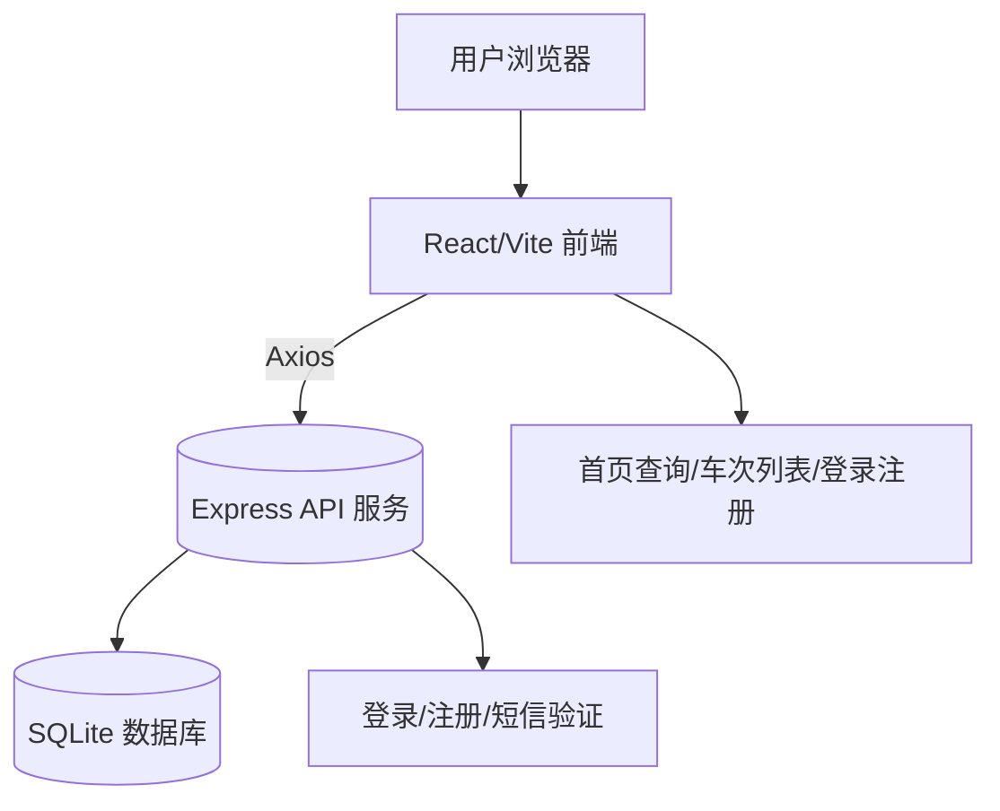
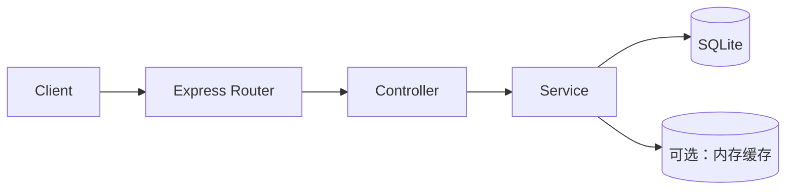

## 1. 架构设计



## 2. 技术描述
- 前端：React@18 + Vite + Axios + 原生 CSS（组件级样式文件）
- 后端：Node.js + Express + sqlite3（现有 users/session/sms 相关服务，新增查询接口）

## 3. 路由定义

| 路由 | 用途 |
|------|------|
| / | 首页查询页，首屏背景与车票查询模块 |
| /login | 登录页，账号口令+短信验证 |
| /register | 注册页，资料采集+短信验证完成注册 |
| /trains | 车次列表页，承载查询结果与二次筛选 |

## 4. API 定义（后端）

### 4.1 现有接口
- GET /api/auth/homepage
  - 响应：`{ success: boolean, content: { title: string, features: Feature[], announcements: any[] } }`

### 4.2 新增接口（建议）
- GET /api/trains/search
  - 请求（Query）：
    - `from: string` 必填，出发站名
    - `to: string` 必填，到达站名
    - `date: string` 必填，ISO 日期（YYYY-MM-DD）
    - `passengerType?: 'normal' | 'student' | 'military'`
    - `onlyHighSpeed?: boolean`
    - `directOnly?: boolean`
  - 响应：
    - `trains: Train[]`
    - `meta: { from: string, to: string, date: string, availableCount: number }`

#### TypeScript 类型（参考）
```ts
type SearchQuery = {
  from: string;
  to: string;
  date: string; // YYYY-MM-DD
  passengerType?: 'normal' | 'student' | 'military';
  onlyHighSpeed?: boolean;
  directOnly?: boolean;
};

type Train = {
  trainNo: string;
  departTime: string; // HH:mm
  arriveTime: string; // HH:mm
  duration: string; // HH:mm
  isHighSpeed: boolean;
  direct: boolean;
  price: number;
  seats: {
    secondClass?: number;
    firstClass?: number;
    business?: number;
    hardSeat?: number;
    softSeat?: number;
  };
};
```

## 5. 服务器架构图



## 6. 数据模型（数据库）

### 6.1 ER 图（建议）

```mermaid
erDiagram
  STATION {
    int id PK
    string name
    string pinyin OPTIONAL
  }
  TRAIN {
    int id PK
    string train_no
    boolean is_high_speed
  }
  SCHEDULE {
    int id PK
    int train_id FK
    int from_station_id FK
    int to_station_id FK
    date run_date
    time depart_time
    time arrive_time
    boolean direct
  }
  SEAT_INVENTORY {
    int id PK
    int schedule_id FK
    int seat_business OPTIONAL
    int seat_first OPTIONAL
    int seat_second OPTIONAL
    int seat_hard OPTIONAL
    int seat_soft OPTIONAL
    decimal base_price
  }
  STATION ||--o{ SCHEDULE : hosts
  TRAIN ||--o{ SCHEDULE : provides
  SCHEDULE ||--o{ SEAT_INVENTORY : has
```

### 6.2 DDL 语句（SQLite）

```sql
CREATE TABLE IF NOT EXISTS stations (
  id INTEGER PRIMARY KEY AUTOINCREMENT,
  name TEXT NOT NULL,
  pinyin TEXT
);

CREATE TABLE IF NOT EXISTS trains (
  id INTEGER PRIMARY KEY AUTOINCREMENT,
  train_no TEXT NOT NULL,
  is_high_speed INTEGER NOT NULL DEFAULT 0
);

CREATE TABLE IF NOT EXISTS schedules (
  id INTEGER PRIMARY KEY AUTOINCREMENT,
  train_id INTEGER NOT NULL,
  from_station_id INTEGER NOT NULL,
  to_station_id INTEGER NOT NULL,
  run_date TEXT NOT NULL,
  depart_time TEXT NOT NULL,
  arrive_time TEXT NOT NULL,
  direct INTEGER NOT NULL DEFAULT 1,
  FOREIGN KEY(train_id) REFERENCES trains(id),
  FOREIGN KEY(from_station_id) REFERENCES stations(id),
  FOREIGN KEY(to_station_id) REFERENCES stations(id)
);

CREATE TABLE IF NOT EXISTS seat_inventory (
  id INTEGER PRIMARY KEY AUTOINCREMENT,
  schedule_id INTEGER NOT NULL,
  seat_business INTEGER,
  seat_first INTEGER,
  seat_second INTEGER,
  seat_hard INTEGER,
  seat_soft INTEGER,
  base_price REAL NOT NULL,
  FOREIGN KEY(schedule_id) REFERENCES schedules(id)
);
```

