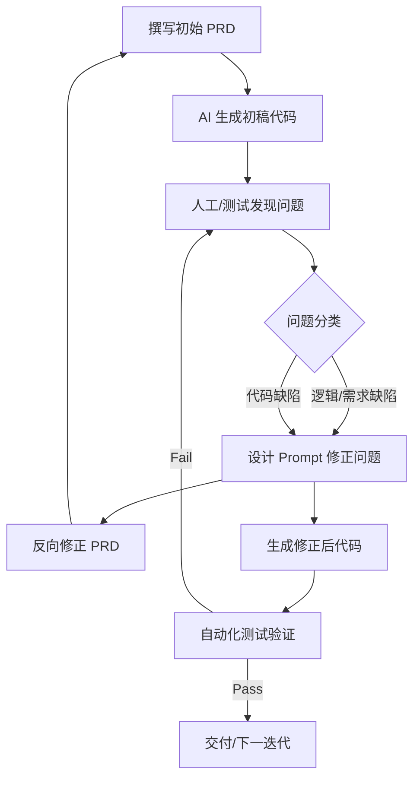

# 需求-设计-测试-实现 迭代开发流程设计思路

## 1. 核心理念：基于 PRD 反馈闭环的迭代开发
本项目采用 **“PRD 驱动 + AI 辅助修正 + 测试验证闭环”** 的开发模式。不仅仅是线性的 Waterfall 模型，而是一个动态修正、自我完善的闭环系统。

### 流程概览图

---

## 2. 详细步骤拆解

### 阶段一：需求定义 (Requirements) - PRD 1.0
**动作**：撰写初始产品需求文档 (PRD)。
*   **内容包含**：
    *   **业务目标**：例如“实现用户注册功能，需包含手机号验证”。
    *   **用户路径 (User Journey)**：Step-by-step 的操作流程。
    *   **验收标准 (Acceptance Criteria)**：如“密码必须包含大小写字母”。
*   **产物**：`artifacts/requirements_v1.md` (示例)

### 阶段二：初稿实现 (Implementation Draft)
**动作**：利用大模型 (LLM) 基于 PRD 生成代码初稿。
*   **输入**：PRD 文档 + 基础 Prompt（“请根据以下 PRD 生成前后端代码...”）。
*   **产物**：
    *   UI 组件 (`frontend/...`)
    *   API 接口 (`backend/...`)
    *   数据库 Schema

### 阶段三：问题发现与反馈 (Feedback Loop)
**动作**：运行代码并对照 PRD 进行 Review，或运行初步测试。
*   **典型问题示例**：
    *   *问题 A*：注册时未校验“确认密码”与“密码”是否一致（逻辑遗漏）。
    *   *问题 B*：点击提交按钮后没有 Loading 状态，导致用户重复提交（体验缺陷）。
    *   *问题 C*：数据库字段 `phone` 长度不够（设计缺陷）。

### 阶段四：Prompt 设计与 PRD 修正 (Correction)
**这是本流程的核心创新点：不直接改代码，而是通过 Prompt 修正逻辑，并反哺 PRD。**

1.  **设计 Prompt**：
    > “在当前的注册逻辑中，缺少了密码一致性校验。请修正代码，并在前端添加实时错误提示。同时，请指出原 PRD 中关于‘密码校验’部分的缺失。”
2.  **反向修正 PRD**：
    *   根据发现的问题，**更新 PRD 文档**。例如，在 PRD 中补充“**必须校验两次输入的密码是否一致**”这一条验收标准。
    *   **意义**：确保文档与代码永远保持同步，文档是“活”的 (Living Documentation)。

### 阶段五：测试验证 (Testing) - 稳定复现的目标
**动作**：基于修正后的 PRD，编写/更新自动化测试用例 (`tests/*.json`)。
*   **测试即文档**：测试用例直接映射 PRD 中的验收标准。
*   **达成“稳定复现”的手段**：
    *   **原子化测试步骤**：将“注册”拆解为“输入-校验-提交”等原子步骤，每个步骤独立验证。
    *   **环境一致性**：使用 Docker 或本地 SQLite 重置脚本，确保每次测试前数据环境是“干净”的（如删除已存在的测试用户）。
    *   **重试机制**：在测试执行器 (`run_tests.py`) 中内置重试逻辑，消除网络波动带来的干扰。

---

## 3. 案例演示：注册功能的演进

| 阶段 | 状态 | 详情 |
| :--- | :--- | :--- |
| **Step 1: PRD 初始版** | *Draft* | 需求：用户输入用户名、密码、手机号即可注册。 |
| **Step 2: 代码初稿** | *v0.1* | 实现了基本的表单提交，但**未校验密码复杂度**，也**未做手机号格式检查**。 |
| **Step 3: 问题发现** | *Review* | 测试发现输入 `123` 作为密码也能注册成功；输入 `abc` 作为手机号后端报错崩塌。 |
| **Step 4: 修正与反哺** | *Prompting* | **Prompt**: "增加密码强校验（8位+大小写）和手机号正则校验。请更新数据库 Schema 以支持更长密码哈希。"   **PRD 更新**: 在 PRD 中显式增加“安全性非功能需求”章节。 |
| **Step 5: 最终实现** | *v1.0* | 代码包含了正则表达式校验；测试用例 `register-password-validation.json` 被创建，专门用于覆盖这些校验逻辑。 |

---

## 4. 总结
这种**“PRD -> Code -> Feedback -> Prompt -> PRD Update -> Test”** 的双向循环模式，解决了传统开发中“文档与代码脱节”的痛点。
*   **文档不再是僵尸文档**，而是随着代码一起进化的“真理来源 (Source of Truth)”。
*   **测试不再是事后诸葛亮**，而是驱动 PRD 完善的催化剂。
