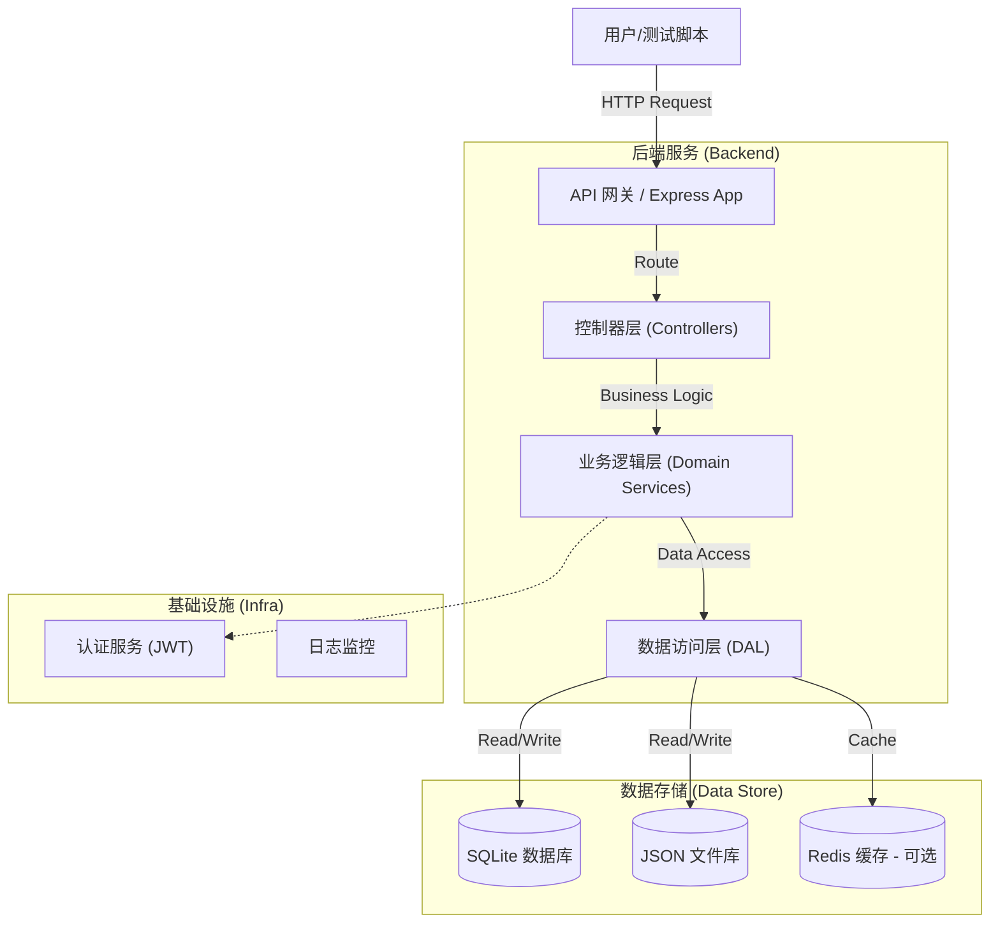

# 12306 自动化测试与系统实现 - 项目架构文档

## 1. 系统概览 (System Overview)

本项目是一个基于 Node.js 构建的 12306 铁路购票系统后端仿真环境，旨在为 LLM 驱动的自动化测试系统（WebTestPilot）提供稳定的被测目标（SUT）。系统采用分层架构设计，实现了从用户认证、车票查询到订单支付的核心业务闭环。

### 核心架构图


---

## 2. 技术栈 (Tech Stack)

### 核心框架
- **运行环境**: Node.js
- **Web 框架**: Express.js v4.18
- **语言**: JavaScript (ES6+)

### 数据存储
- **关系型数据库**: SQLite (`sql.js`) - 用于存储列车、车站、时刻表等结构化数据。
- **文档型存储**: JSON - 用于存储用户配置、模拟数据或轻量级持久化。
- **缓存/会话**: Redis (支持), 内存缓存。

### 安全与认证
- **身份验证**: JSON Web Tokens (JWT) (RS256 非对称加密)。
- **密码加密**: bcryptjs。
- **安全防护**: Helmet (HTTP 头安全), Express-Validator (输入校验)。

### 测试与工具
- **单元测试**: Jest, Supertest。
- **开发工具**: Nodemon, Dotenv。

---

## 3. 模块架构设计 (Module Architecture)

系统严格遵循 **MVC (Model-View-Controller)** 的变体 —— **Controller-Service-Repository** 分层架构，确保关注点分离。

### 3.1 控制器层 (Controllers)
*路径: `backend/src/controllers`*
负责处理 HTTP 请求，参数校验，并调用服务层。
- `authController.js`: 处理注册、登录、注销。
- `trainController.js`: 处理车票查询、车次搜索。
- `orderController.js`: 处理订单创建、支付、取消。
- `passengerController.js`: 处理乘客信息的增删改查。

### 3.2 业务服务层 (Services / Domain Providers)
*路径: `backend/src/domain-providers`*
封装核心业务逻辑，不直接依赖 HTTP 协议。
- `ticketService.js`: 余票计算、席位分配算法。
- `orderService.js`: 订单状态机流转、库存扣减逻辑。
- `authService.js`: JWT 签发与验签。
- `dataDiffService.js`: 负责数据比对，用于测试验证。

### 3.3 数据访问层 (Data Access)
*路径: `backend/src/domain-providers` (dbService)*
统一的数据访问接口，屏蔽底层存储差异。
- `dbService.js`: SQLite 数据库操作封装。
- `jsonDbService.js`: JSON 文件读写封装。
- `official12306Api.js`: (模拟) 与官方接口的数据交互适配器。

---

## 4. 核心业务流程 (Core Workflows)

### 4.1 购票全流程
1. **查询 (Search)**: 用户发起查询 -> `trainController` 解析参数 -> `trainDataService` 检索 SQLite -> 返回车次列表。
2. **下单 (Booking)**: 用户提交订单 -> `orderController` -> `orderService` 校验库存 -> 锁定席位 -> 生成未支付订单。
3. **支付 (Payment)**: 用户支付 -> `orderController` -> `orderService` 更新状态 -> 触发出票逻辑。

### 4.2 自动化测试闭环
1. **重置环境**: 测试脚本调用 API 重置数据库快照。
2. **执行操作**: WebTestPilot 驱动浏览器或 API 客户端执行业务操作。
3. **状态验证**: 调用 `inspect_db.js` 或后端 API 查询数据库最终状态，与预期结果比对。

---

## 5. 目录结构说明 (Directory Structure)

```
e:\LQiu\CS3604\12306_Follow\
├── backend/                # 后端核心代码
│   ├── src/
│   │   ├── controllers/    # 请求处理器
│   │   ├── domain-providers/# 业务逻辑服务
│   │   ├── routes/         # API 路由定义
│   │   ├── database/       # 数据库 Schema
│   │   └── app.js          # 应用入口
│   ├── database/           # 数据文件 (SQLite/JSON)
│   ├── certs/              # JWT 密钥 (公私钥)
│   └── package.json        # 依赖配置
├── artifacts/              # 接口定义 (YAML)
├── scripts/                # 辅助脚本 (DB生成、数据处理)
└── Detailed_Requirements_List.md # 需求追踪文档
```

## 6. 接口设计规范 (API Design)

遵循 RESTful 风格，主要资源端点：
- `POST /api/v1/auth/login`: 用户登录
- `GET /api/v1/trains/search`: 车票查询
- `POST /api/v1/orders`: 创建订单
- `GET /api/v1/passengers`: 获取乘客列表

---
*文档生成时间：2025-12-29*
