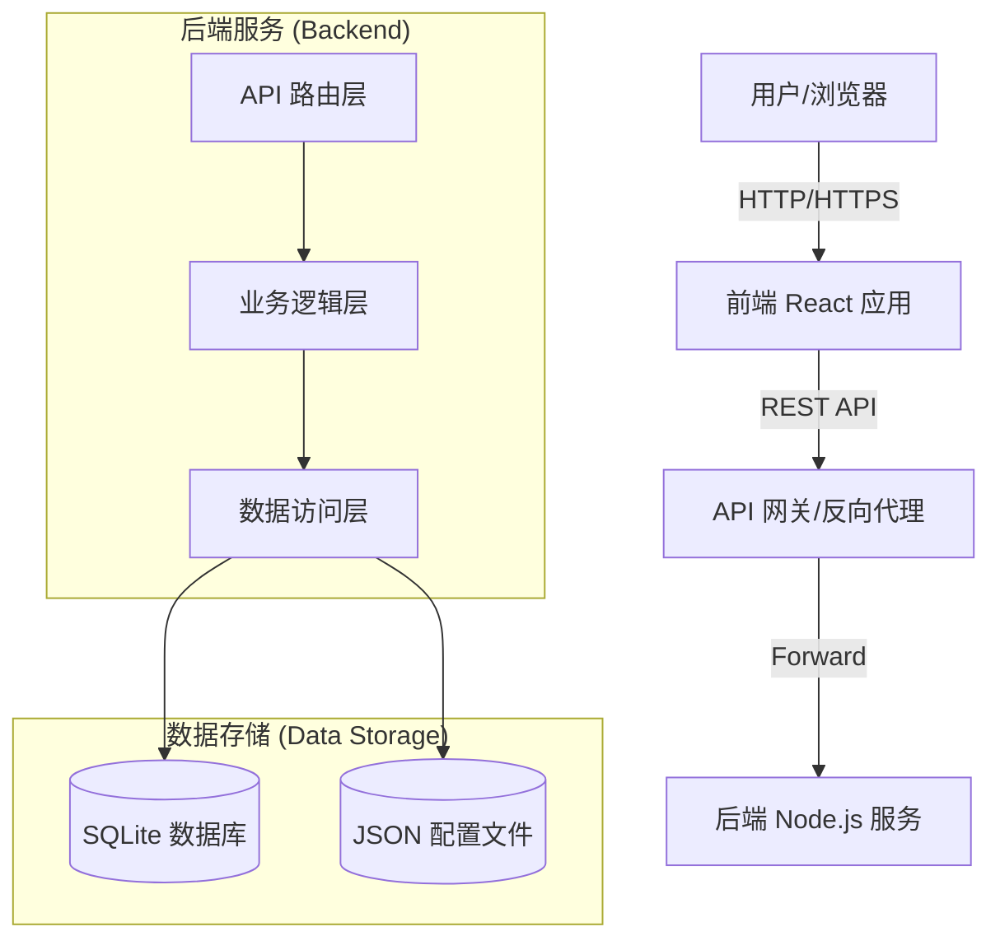

# Our-12306 铁路购票系统复刻项目

> **⚠️ 注意**：本项目仅供学习与研究使用，非官方 12306 网站。

## 1. 项目简介

### 1.1 背景与目标
本项目旨在通过复刻中国铁路 12306 购票系统，构建一个高仿真、全流程的 Web 应用。项目不仅致力于掌握全栈开发技术，更侧重于深入理解大型高并发系统的业务逻辑设计、复杂状态管理以及现代软件工程中的“需求-设计-实现-测试”闭环流程。

### 1.2 核心价值
*   **全栈实践**：涵盖前端 UI 复刻、后端 API 设计、数据库建模及全链路测试。
*   **TDD 驱动**：采用测试驱动开发模式，确保代码质量与业务逻辑的正确性。
*   **工程化规范**：遵循严格的代码规范、Git 工作流及文档管理。

### 1.3 目标用户
*   全栈开发学习者
*   对高并发系统设计感兴趣的工程师
*   Web 自动化测试研究人员

---

## 2. 项目架构

### 2.1 系统架构图
系统采用经典的前后端分离架构，遵循 **Controller-Service-Repository** 分层设计模式。



### 2.2 核心模块交互
*   **用户认证**：前端通过 JWT 与后端进行无状态身份验证。
*   **车票查询**：前端发起查询请求，后端通过 Service 层计算余票并返回。
*   **订单处理**：采用乐观锁机制处理并发购票请求，确保库存数据一致性。

---

## 3. 技术栈

### 3.1 前端 (Frontend)
*   **框架**：React 18 + TypeScript + Vite
    *   *理由*：高性能、类型安全、开发体验极佳。
*   **状态管理**：React Context API
    *   *理由*：轻量级，满足中等规模应用的状态共享需求。
*   **样式**：CSS Modules / Tailwind CSS
    *   *理由*：模块化样式，避免冲突。
*   **HTTP 客户端**：Axios
    *   *理由*：拦截器支持，便于处理统一的请求/响应逻辑。

### 3.2 后端 (Backend)
*   **运行环境**：Node.js + Express.js
    *   *理由*：生态丰富，适合快速构建 RESTful API。
*   **安全**：Helmet, CORS, Bcrypt
    *   *理由*：提供基础的安全防护和密码加密。
*   **日志**：自定义分级 Logger
    *   *理由*：统一日志格式，便于调试和监控。

### 3.3 数据库 (Database)
*   **主库**：SQLite (better-sqlite3)
    *   *理由*：轻量级，零配置，非常适合开发和测试环境。
*   **辅助存储**：JSON 文件
    *   *理由*：存储静态配置数据。

---

## 4. TDD 开发流程

本项目采用 **测试驱动开发 (Test-Driven Development)** 模式。详细工作流请参考 [敏捷 TDD 工作流指南](../Agile_TDD_Workflow_Guide.md)。

### 4.1 开发步骤
1.  **编写测试 (Red)**：根据需求文档，编写一个失败的测试用例（单元测试或集成测试）。
2.  **实现代码 (Green)**：编写最少量的代码让测试通过。
3.  **重构 (Refactor)**：优化代码结构，确保代码质量，同时保证测试依然通过。

### 4.2 测试规范
*   **单元测试**：针对 Service 层纯函数，关注业务逻辑的正确性。
*   **集成测试**：针对 API 接口，验证 HTTP 请求、数据库交互及错误处理。
*   **E2E 测试**：模拟用户真实操作，验证全链路流程。

### 4.3 覆盖率要求
*   核心业务模块（如订单、支付）测试覆盖率需达到 **90%** 以上。
*   工具类函数覆盖率需达到 **100%**。

---

## 5. 运行测试指南

### 5.1 后端测试
```bash
cd backend
# 运行所有测试
npm test

# 运行特定文件的测试
npm test -- test/routes/orders.test.js

# 生成覆盖率报告
npm run test:coverage
```

### 5.2 前端测试
```bash
cd frontend
# 运行所有组件测试
npm test

# 开启 UI 模式查看测试报告
npm run test:ui
```

### 5.3 结果解读
*   **PASS**：测试通过，功能符合预期。
*   **FAIL**：测试失败，需检查报错日志进行修复。
*   **Coverage**：关注 Statements (语句), Branches (分支), Functions (函数), Lines (行) 的覆盖率百分比。

---

## 6. 环境要求

### 6.1 硬件配置
*   CPU: 双核 2.0GHz 及以上
*   内存: 4GB RAM 及以上
*   磁盘: 至少 2GB 可用空间

### 6.2 软件依赖
*   **Node.js**: v18.0.0 或更高版本
*   **npm**: v9.0.0 或更高版本
*   **Git**: v2.0.0 或更高版本

### 6.3 操作系统
*   Windows 10/11
*   macOS 10.15+
*   Linux (Ubuntu 20.04+, CentOS 8+)

---

## 7. 端口配置

| 服务 | 默认端口 | 配置文件 | 环境变量 |
| :--- | :--- | :--- | :--- |
| **前端服务** | 5173 | `frontend/vite.config.ts` | `PORT` |
| **后端服务** | 3000 | `backend/.env` | `PORT` |
| **测试浏览器** | 9222 | `WebTestPilot/.../.env` | `CDP_ENDPOINT` |

**修改端口示例**：
在 `backend/.env` 文件中添加：
```env
PORT=3001
```

---

## 8. 测试用例文档

### 8.1 用例分类
*   **功能测试**：验证各功能模块是否按预期工作。
*   **边界测试**：验证极端输入下的系统表现（如空值、超长字符）。
*   **异常测试**：验证系统对错误情况的处理（如网络中断、库存不足）。

### 8.2 典型场景
*   **场景 1：用户注册流程**
    *   输入合法手机号 -> 获取验证码 -> 提交注册 -> 数据库生成用户记录。
*   **场景 2：并发购票**
    *   多个用户同时购买同一车次最后一张票 -> 仅一人成功，其余提示无票。

### 8.3 数据准备
测试数据通常在测试脚本的 `beforeAll` 或 `beforeEach` 钩子中进行初始化，并在 `afterAll` 中进行清理，以保证测试环境的纯净。

---

## 9. 主要功能模块

### 9.1 用户认证模块
*   **功能**：注册、登录、注销、密码找回。
*   **接口**：`/api/auth/*`
*   **依赖**：`AuthService`, `UserDB`

### 9.2 车票查询模块
*   **功能**：站站查询、车次筛选、余票显示。
*   **接口**：`/api/trains/*`, `/api/tickets/*`
*   **依赖**：`TrainService`, `StationService`

### 9.3 订单管理模块
*   **功能**：下单、支付、取消、退票、改签。
*   **接口**：`/api/orders/*`
*   **依赖**：`OrderService`, `PaymentService`, `TicketService`

### 9.4 个人中心
*   **功能**：个人信息管理、常用联系人管理。
*   **接口**：`/api/user/*`, `/api/passengers/*`
*   **依赖**：`UserService`, `PassengerService`

---

## 快速开始

### 1. 安装依赖
```bash
# 安装后端依赖
cd backend
npm install

# 安装前端依赖
cd ../frontend
npm install
```

### 2. 启动服务
在**两个独立的终端窗口**中分别运行：

**终端 1 - 后端服务**：
```bash
cd backend
npm start
```

**终端 2 - 前端服务**：
```bash
cd frontend
npm run dev
```

### 3. 访问应用
打开浏览器访问：http://localhost:5173
